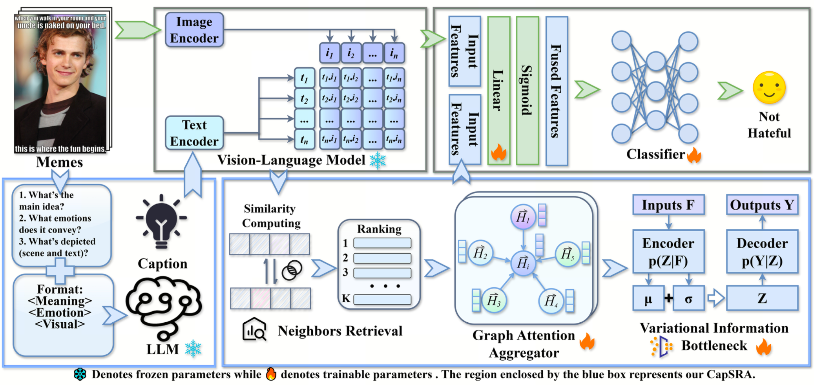

# CapSRA

<div align="center">

## LMM-Guided Caption Semantic Retrieval Aggregation for Hateful Meme Detection

[](https://www.sciencedirect.com/science/article/abs/pii/S0031320326007466)
[](./requirements.txt)
[](./LICENSE)
[](./README.md)

</div>

## Table of Contents

- [Overview](#overview)
- [Framework](#framework)
- [Main Results](#main-results)
- [Quick Start](#quick-start)
- [Reproduction](#reproduction)
- [Documentation](#documentation)

## Overview

CapSRA is a retrieval-augmented framework for hateful meme detection. It combines:

- LMM-guided meme-aware caption generation
- caption-enhanced multimodal retrieval over semantic neighbors
- graph attention based neighbor aggregation
- information bottleneck based feature compression
- plug-in integration with multiple base architectures

## Framework

<div align="center">
  
</div>

## Highlights

- End-to-end CapSRA workflow from caption generation to semantic retrieval
- Retrieval-augmented multimodal reasoning for hateful meme detection
- Reproducible project layout for paper-oriented experimentation
- Release assets for mainline runs, patch-based baselines, and documentation

## Related Work

| Model family | Paper / Code |
| --- | --- |
| `PromptHate` | [GitHub](https://github.com/Social-AI-Studio/PromptHate) |
| `Pro-Cap` | [GitHub](https://github.com/Social-AI-Studio/Pro-Cap) |
| `CapSRA` | [Paper](https://www.sciencedirect.com/science/article/abs/pii/S0031320326007466) |

## Main Results

Table 3 reports the performance of CapSRA across `FHM`, `HarMeme`, and `MAMI`. Values are reported as mean `+-` standard deviation over 5 seeds.

### FHM

| Model | Acc. | AUC | Macro-F1 |
| --- | ---: | ---: | ---: |
| ViLT | 60.20 +- 0.54 | 65.77 +- 0.83 | 58.04 +- 1.61 |
| ViLT + CapSRA | 63.40 +- 1.85 | 66.17 +- 1.11 | 63.38 +- 0.81 |
| Improvement | +3.20 | +0.40 | +5.34 |
| CLIP | 65.40 +- 0.71 | 72.17 +- 0.67 | 63.28 +- 0.57 |
| CLIP + CapSRA | 69.20 +- 0.89 | 73.32 +- 1.76 | 69.95 +- 0.51 |
| Improvement | +3.80 | +1.15 | +6.67 |
| MOMENTA | 61.63 +- 1.37 | 69.17 +- 0.91 | 63.04 +- 1.71 |
| MOMENTA + CapSRA | 68.28 +- 1.11 | 73.51 +- 0.89 | 67.62 +- 1.88 |
| Improvement | +6.65 | +4.34 | +4.58 |
| LMM-CLIP | 70.87 +- 0.66 | 75.92 +- 0.28 | 68.89 +- 0.98 |
| LMM-CLIP + CapSRA | 71.40 +- 1.91 | 76.56 +- 0.42 | 70.27 +- 0.43 |
| Improvement | +0.53 | +0.64 | +1.38 |
| PromptHate | 72.98 +- 0.61 | 81.45 +- 0.47 | 72.55 +- 0.89 |
| PromptHate + CapSRA | 74.60 +- 0.71 | 83.62 +- 0.51 | 74.38 +- 1.82 |
| Improvement | +1.62 | +2.17 | +1.83 |
| Pro-Cap | 75.10 +- 0.47 | 83.58 +- 0.31 | 73.72 +- 0.61 |
| Pro-Cap + CapSRA | 77.80 +- 0.51 | 85.41 +- 0.37 | 76.05 +- 0.71 |
| Improvement | +2.70 | +1.83 | +2.33 |
| RAPN | 68.60 +- 0.72 | 75.08 +- 1.43 | 67.50 +- 0.40 |
| RAPN + CapSRA | 71.47 +- 0.99 | 76.04 +- 0.92 | 71.45 +- 1.00 |
| Improvement | +2.87 | +0.96 | +3.95 |
| HateCLIPper | 73.82 +- 0.89 | 81.25 +- 0.61 | 71.08 +- 1.27 |
| HateCLIPper + RGL | 74.31 +- 0.91 | 82.16 +- 0.77 | 72.12 +- 1.17 |
| HateCLIPper + RGL + CapSRA | 75.80 +- 1.95 | 83.55 +- 0.54 | 72.77 +- 0.86 |
| Improvement vs. HateCLIPper | +2.48 | +1.39 | +1.65 |

### HarMeme

| Model | Acc. | AUC | Macro-F1 |
| --- | ---: | ---: | ---: |
| ViLT | 79.66 +- 0.63 | 81.53 +- 0.57 | 76.82 +- 0.99 |
| ViLT + CapSRA | 81.32 +- 0.71 | 82.72 +- 0.49 | 79.08 +- 0.27 |
| Improvement | +1.66 | +1.19 | +2.26 |
| CLIP | 81.16 +- 0.59 | 86.84 +- 0.47 | 79.92 +- 0.81 |
| CLIP + CapSRA | 83.25 +- 0.41 | 88.51 +- 0.59 | 82.61 +- 0.71 |
| Improvement | +2.09 | +1.67 | +2.69 |
| MOMENTA | 81.82 +- 0.81 | 86.32 +- 0.61 | 82.80 +- 0.93 |
| MOMENTA + CapSRA | 86.31 +- 0.61 | 92.06 +- 0.47 | 85.60 +- 1.11 |
| Improvement | +4.49 | +5.74 | +2.80 |
| LMM-CLIP | 86.80 +- 0.46 | 90.73 +- 0.12 | 83.06 +- 1.01 |
| LMM-CLIP + CapSRA | 88.74 +- 0.13 | 91.72 +- 0.19 | 84.00 +- 0.15 |
| Improvement | +1.94 | +0.99 | +0.94 |
| PromptHate | 84.47 +- 0.57 | 90.96 +- 0.31 | 82.25 +- 0.71 |
| PromptHate + CapSRA | 85.31 +- 0.47 | 91.61 +- 0.41 | 84.73 +- 0.67 |
| Improvement | +0.84 | +0.65 | +2.48 |
| Pro-Cap | 85.03 +- 0.41 | 91.03 +- 0.27 | 85.98 +- 0.51 |
| Pro-Cap + CapSRA | 87.95 +- 1.77 | 93.34 +- 0.52 | 88.42 +- 0.47 |
| Improvement | +2.92 | +2.31 | +2.44 |
| RAPN | 84.46 +- 1.02 | 90.23 +- 0.38 | 83.28 +- 0.65 |
| RAPN + CapSRA | 86.91 +- 0.43 | 91.55 +- 1.84 | 86.12 +- 0.42 |
| Improvement | +2.45 | +1.32 | +2.84 |
| HateCLIPper | 84.80 +- 0.61 | 89.70 +- 0.51 | 80.50 +- 0.91 |
| HateCLIPper + RGL | 85.03 +- 0.51 | 90.05 +- 0.47 | 81.75 +- 0.87 |
| HateCLIPper + RGL + CapSRA | 86.08 +- 0.67 | 91.59 +- 0.81 | 81.85 +- 1.01 |
| Improvement vs. HateCLIPper | +1.25 | +1.54 | +1.10 |

### MAMI

| Model | Acc. | AUC | Macro-F1 |
| --- | ---: | ---: | ---: |
| ViLT | 66.90 +- 0.87 | 73.57 +- 1.03 | 66.32 +- 0.71 |
| ViLT + CapSRA | 69.50 +- 1.17 | 74.24 +- 1.92 | 69.07 +- 0.81 |
| Improvement | +2.60 | +0.67 | +2.75 |
| CLIP | 70.50 +- 0.91 | 80.79 +- 0.71 | 70.31 +- 1.07 |
| CLIP + CapSRA | 72.35 +- 1.11 | 81.01 +- 0.67 | 72.21 +- 0.53 |
| Improvement | +1.85 | +0.22 | +1.90 |
| MOMENTA | 72.10 +- 1.27 | 81.68 +- 0.89 | 70.31 +- 1.61 |
| MOMENTA + CapSRA | 75.06 +- 1.41 | 84.86 +- 0.97 | 73.76 +- 1.51 |
| Improvement | +2.96 | +3.18 | +3.45 |
| LMM-CLIP | 73.63 +- 0.42 | 83.80 +- 0.58 | 76.71 +- 0.24 |
| LMM-CLIP + CapSRA | 74.97 +- 1.73 | 85.28 +- 0.34 | 78.90 +- 0.44 |
| Improvement | +1.34 | +1.48 | +2.19 |
| PromptHate | 70.31 +- 0.91 | 79.95 +- 0.61 | 70.02 +- 1.17 |
| PromptHate + CapSRA | 72.84 +- 0.87 | 82.46 +- 0.71 | 72.25 +- 1.21 |
| Improvement | +2.53 | +2.51 | +2.23 |
| Pro-Cap | 74.63 +- 0.77 | 83.77 +- 0.58 | 73.15 +- 0.89 |
| Pro-Cap + CapSRA | 75.98 +- 0.61 | 84.85 +- 0.67 | 75.69 +- 0.91 |
| Improvement | +1.35 | +1.08 | +2.54 |
| RAPN | 73.10 +- 1.31 | 81.51 +- 0.91 | 72.49 +- 1.58 |
| RAPN + CapSRA | 74.30 +- 0.56 | 84.14 +- 0.77 | 73.66 +- 0.59 |
| Improvement | +1.20 | +2.63 | +1.17 |
| HateCLIPper | 74.40 +- 1.07 | 82.84 +- 0.87 | 77.82 +- 1.41 |
| HateCLIPper + RGL | 75.60 +- 0.94 | 85.24 +- 1.02 | 78.93 +- 0.67 |
| HateCLIPper + RGL + CapSRA | 76.20 +- 1.17 | 86.27 +- 1.22 | 80.02 +- 1.74 |
| Improvement vs. HateCLIPper | +1.80 | +3.43 | +2.20 |

## Repository Layout

```text
CapSRA-master/
├── README.md
├── LICENSE
├── CITATION.cff
├── pic.png
├── requirements.txt
├── run_capsra.py
├── main.py
├── train_eval.py
├── baselines/
├── baseline_patches/
├── configs/
├── data/
├── docs/
├── examples/
├── models/
├── scripts/
└── utils/
```

## Installation

```bash
python -m venv .venv
source .venv/bin/activate
pip install -r requirements.txt
```

## Data Format

Each split is expected as a JSONL file with one sample per line:

```json
{"id": "sample_id", "img": "sample.png", "text": "meme text", "label": 0}
```

The mainline loader accepts:

- image field: `img` or `image`
- text field: `text`, `caption`, or `description`
- label field: `label` or `labels`

## Quick Start

### 1. Generate meme-aware captions

```bash
python scripts/preprocess/generate_captions.py \
  --jsonl_file /path/to/train_fix.jsonl \
  --img_folder /path/to/img \
  --output_file outputs/captions/train_captions.json \
  --device cuda:0
```

### 2. Build retrieval features and neighbors

```bash
python scripts/preprocess/build_retrieval.py \
  --base_model /path/to/backbone_choice \
  --train_jsonl /path/to/train_fix.jsonl \
  --query_jsonl /path/to/val_fix.jsonl \
  --train_caption_json outputs/captions/train_captions.json \
  --query_caption_json outputs/captions/val_captions.json \
  --image_dir /path/to/img \
  --train_feature_out outputs/features/train_feats.pt \
  --query_feature_out outputs/features/val_feats.pt \
  --train_neighbor_out outputs/neighbors/train_neighbors.json \
  --query_neighbor_out outputs/neighbors/val_neighbors.json \
  --top_k 10 \
  --exclude_self
```

### 3. Train CapSRA

```bash
python run_capsra.py \
  --data_dir /path/to/dataset_root \
  --feature_path_train outputs/features/train_feats.pt \
  --feature_path_val outputs/features/val_feats.pt \
  --feature_path_test outputs/features/test_feats.pt \
  --neighbor_path_train outputs/neighbors/train_neighbors.json \
  --neighbor_path_val outputs/neighbors/val_neighbors.json \
  --neighbor_path_test outputs/neighbors/test_neighbors.json \
  --output_dir runs/capsra
```

## Reproduction

- Mainline preprocessing and training are documented in `docs/reproduction.md`
- Patch-based baseline integration is documented in `baseline_patches/README.md`
- Config presets are provided in `configs/`

## Documentation

- [Reproduction Guide](./docs/reproduction.md)
- [Project Structure](./docs/project_structure.md)
- [Results](./docs/results.md)
- [Baseline Patch Bundle](./baseline_patches/README.md)
- [Config Presets](./configs/README.md)
- [Examples](./examples/README.md)
- [Contributing](./CONTRIBUTING.md)

## Citation

If you use this repository in your research, please cite the CapSRA paper.

```bibtex
@article{capsra2026,
  title = {CapSRA: LMM-guided caption semantic retrieval aggregation for hateful meme detection},
  journal = {Pattern Recognition},
  year = {2026}
}
```